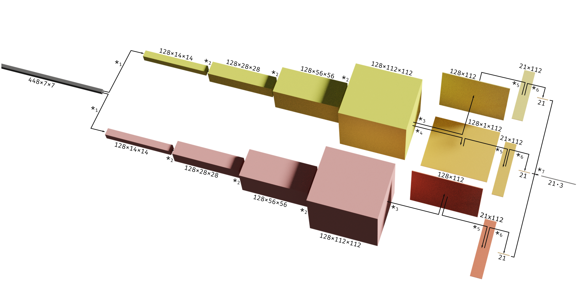

# An Efficient Encoder-Decoder Architecture for 3DHand Pose Estimation



# General Note 

The report file is `REPORT.pdf`. The folder `src` contains all the code and the folder `config` all the config files. The folder `config/experiment` contains most of the experiments we runned with the detailed hyperparameters. We added 2 experiments files `exp_sumission_wandb.yaml` and `exp_sumission.yaml` that can be used to reproduce our results, read the section below for all details. If you want to run the model from our last checkpoint either for testing or to resume training you can download the checkpoint 
[here](https://drive.google.com/drive/folders/1RCIHCCRs8nBTMz5R_J7On9RNVhZr5hoo?usp=sharing). Again, below you will find details on how to run it. 
The code for the architectures can be found in `src/models/architectures`. More precisely in `effpose.py` and `decoders/posef1_decoder.py`.

# Reproduce Results

We start at the root of the project on Leonhard cluster.

1. Install a virtual environment using virtualenv, called `venv`. 
```console 
python3 -m venv venv
```

2. Activate the virtual env and the right modules.
```console 
source venv/bin/activate && module load eth_proxy gcc/6.3.0 python_gpu/3.8.5
```

3. Install requirements.
```console 
pip3 install -r requirements.txt 
```

4. Make a `.env` file by copying the example template `.env.tmp`:
```console 
cp .env.tmp .env
```

5. Open the `.env` file any text editor and change the defaults with the correct environment variables, here it's helpful if you make a project on [wandb.ai](https://wandb.ai) and add your credentials. This will plot the model predictions, loss, and heatmaps, however the `WANDB_` variables are not strictly necessary if you don't want to see any logging. Here's an example of how my `.env` file looks (the api-key is obfuscated):
```console 
WANDB_PROJECT=hand-pose-estimation
WANDB_ENTITY=schneider
WANDB_API_KEY=XXXXXXXXXXXXXXXXXXXXXXXXXXXXXXXXX
MP_DATA=/cluster/project/infk/hilliges/lectures/mp21/project1/freihand_dataset_MP 
DIR_SCRATCH=/cluster/scratch/scflavio/mp_project
```
Note that MP_DATA and DIR_SCRATCH are necessary. DIR_SCRATCH will be the path to all logs, i.e. model checkpoints,experiemnt parameters, and predictions when the model finishes training. 

6. Run the experiment (read below if you didn't add `WANDB_`  to the `.env` file)
```console 
bsub -W 120:00 -R "rusage[mem=64000, ngpus_excl_p=1]" -R "select[gpu_mtotal0>=10240]" python3 ./run.py experiment=exp_submission_wandb
```
This experiment will run for 145 epochs which will take approximately 120H, the details of the experiment can be found inside of the file `configs/experiment/exp_sumission_wandb.yaml`. If you used wandb, at the end of the training you can download the submission file `test_preds.json.gz` from the files tab of the project on [wandb.ai/entity/project](https://wandb.ai/). If you don't want to use wandb you have to run another experiment (which excludes callbacks to log to wandb) with the following code:
```console 
bsub -W 120:00 -R "rusage[mem=64000, ngpus_excl_p=1]" -R "select[gpu_mtotal0>=10240]" python3 ./run.py experiment=exp_submission
```
This will run again for 145 epochs. At the end of the training procedure you will find the predictions file `test_preds.json.gz` in the following directory template `DIR_SCRATCH/logs/preds/YYYY-MM-DD/HH-MM-SS/test_preds.json.gz` the date and time will depend on when the job is started, for example `/cluster/scratch/scflavio/mp_project/logs/preds/2021-06-15/15-01-55/test_preds.json.gz`. 


# Extra 

## Resume model from checkpoint 
If you want to resume a run, checkpoints of the model at the best metric or last epoch are kept in the scratch diretory at `DIR_SCRATCH/logs/ckpts/YYYY-MM-DD/HH-MM-SS/'last.ckpt'`. Example to resume from the last epoch and run for 24h: 
```console
bsub -W 24:00 -R "rusage[mem=64000, ngpus_excl_p=1]" -R "select[gpu_mtotal0>=10240]" python3 ./run.py experiment=test_submission_wandb +model.checkpoint_path=/cluster/scratch/scflavio/mp_project/logs/ckpts/2021-06-15/08-35-27/'last.ckpt'
```
Or similarly if you don't use wandb:
```console
bsub -W 24:00 -R "rusage[mem=64000, ngpus_excl_p=1]" -R "select[gpu_mtotal0>=10240]" python3 ./run.py experiment=test_submission +model.checkpoint_path=/cluster/scratch/scflavio/mp_project/logs/ckpts/2021-06-15/08-35-27/'last.ckpt'
```
Note that this can be started from a checkpoint of a model even while the original model is running. The checkpoint stores all the model weights and configurations. 


## Test model from checkpoint
If you wan to test a model from a checkpoint it's the same as resuming a run where we only add the `test=True` parameter to the command. Example with wandb (note that only a 1h job is sufficient):
```console
bsub -W 01:00 -R "rusage[mem=64000, ngpus_excl_p=1]" -R "select[gpu_mtotal0>=10240]" python3 ./run.py experiment=test_submission_wandb +model.checkpoint_path=/cluster/scratch/scflavio/mp_project/logs/ckpts/2021-06-15/08-35-27/'last.ckpt' test=True 
```
Or without wandb:
```console
bsub -W 01:00 -R "rusage[mem=64000, ngpus_excl_p=1]" -R "select[gpu_mtotal0>=10240]" python3 ./run.py experiment=test_submission +model.checkpoint_path=/cluster/scratch/scflavio/mp_project/logs/ckpts/2021-06-15/08-35-27/'last.ckpt' test=True 
```
Note that also in this case we can test the model from a checkpoint even while the original model is running.

## Test model on our best checkpoint
[Here](https://drive.google.com/drive/folders/1RCIHCCRs8nBTMz5R_J7On9RNVhZr5hoo?usp=sharing) we uploaded our best model checkpoint named `f033_6.246.ckpt` which scores 6.246 on the public leaderboard. To generate the submission without any training you can run download the checkpoint on the root of the project and run:
```console
bsub -W 01:00 -R "rusage[mem=64000, ngpus_excl_p=1]" -R "select[gpu_mtotal0>=10240]" python3 ./run.py experiment=test_submission_wandb +model.checkpoint_path='f033_6.246.ckpt' test=True 
```
Or without wandb:
```console
bsub -W 01:00 -R "rusage[mem=64000, ngpus_excl_p=1]" -R "select[gpu_mtotal0>=10240]" python3 ./run.py experiment=test_submission +model.checkpoint_path='f033_6.246.ckpt' test=True 
```


